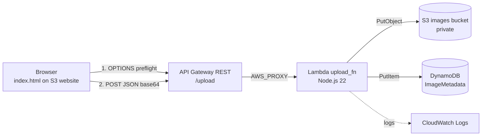

# Architecture

```mermaid
flowchart LR
  B[Browser<br/>index.html on S3 website] -->|1. OPTIONS preflight| A[API Gateway REST<br/>/upload]
  B -->|2. POST JSON base64| A
  A -->|AWS_PROXY| L[Lambda upload_fn<br/>Node.js 22]
  L -->|PutObject| S[(S3 images bucket<br/>private)]
  L -->|PutItem| D[(DynamoDB<br/>ImageMetadata)]
  L -.->|logs| C[CloudWatch Logs]
```

- OPTIONS is answered by a MOCK integration (Lambda is never invoked).
- POST goes through Lambda proxy integration; Lambda returns the full HTTP response, including CORS headers.
