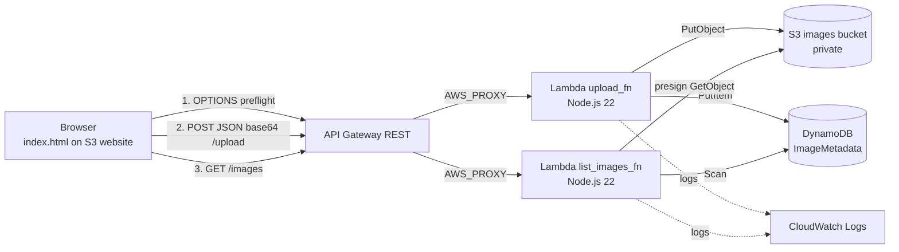

# Architecture

- OPTIONS on `/upload` is answered by a MOCK integration (Lambda is never invoked). `GET /images` has no OPTIONS route: it's a CORS "simple request" (no custom headers, no body), so the browser never preflights it.
- Both routes use Lambda proxy integration; each Lambda returns the full HTTP response, including its own CORS headers.
- `upload_fn` and `list_images_fn` have **separate IAM roles**. `upload_fn` can only `PutObject`/`PutItem`; `list_images_fn` can only `Scan`/`GetObject` (the latter just to mint presigned URLs — it never streams image bytes through the function).
- `list_images_fn` returns image metadata plus a presigned S3 URL per image (5-minute expiry), since the images bucket itself stays private.
- It reads the table with a `Scan`, not a `Query` — there's no secondary index to query against, so this doesn't scale past a small/demo-sized table or guarantee upload-order results. The real fix is a GSI with a constant partition key and `uploadedAt` as the sort key.
