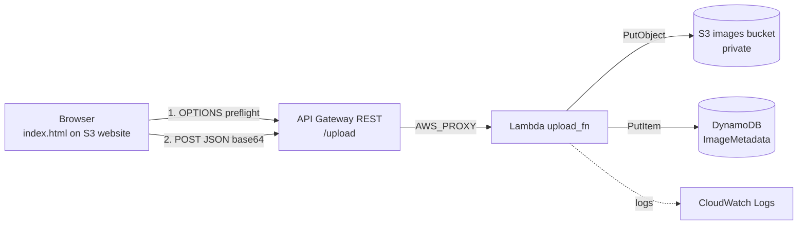

Hands-on serverless application demonstrating Infrastructure as Code (IaC) with Terraform and AWS serverless services.

---

# Overview

Serverless Image API is a cloud engineering project that demonstrates how to provision and deploy a serverless image upload application on AWS using Terraform.

A static web page (S3) sends an image to an API (API Gateway). A Lambda function validates it, stores the file in a private S3 bucket, and saves its metadata in DynamoDB. One `terraform apply` builds everything, and `terraform destroy` removes it.

**Stack:** S3, API Gateway (REST), Lambda (Node.js 22), DynamoDB (on-demand), IAM, CloudWatch Logs, Terraform.

---

# Architecture



1. The browser sends an `OPTIONS /upload` CORS preflight. API Gateway answers it with a MOCK integration.
2. The browser sends `POST /upload` with JSON `{ image (base64), fileName, contentType }`.
3. Lambda validates the input, saves `uploads/<uuid>.<ext>` to S3, and writes metadata to DynamoDB.
4. Lambda returns `{ message, imageId }` with CORS headers.

---

# Project structure

```
terraform/   main.tf, variables.tf, outputs.tf, provider.tf
lambda/      uploadimage.js        (function code, zipped by Terraform)
frontend/    index.html.tpl        (template: Terraform injects the API URL)
docs/        architecture.md
```

---

# Deploy

Prerequisites: Terraform >= 1.5 and an AWS CLI profile (the default profile name is `tf-dev`).

```bash
git clone https://github.com/tvero1011/serverless-image-api.git
cd serverless-image-api/terraform
terraform init
terraform apply -var="aws_profile=YOUR_PROFILE"
```

S3 bucket names are globally unique. If you get `BucketAlreadyExists`, pass your own:
`-var="frontend_bucket_name=..." -var="images_bucket_name=..."`

Terraform prints `frontend_url` (open it in a browser) and `api_gateway_url`.

---

# Test the API

```bash
curl -X POST "<api_gateway_url>" \
  -H "Content-Type: application/json" \
  -d '{"image":"<base64>","fileName":"test.png","contentType":"image/png"}'
```

On Windows PowerShell use `curl.exe` (plain `curl` is an alias for `Invoke-WebRequest` and rejects `-X`).
Then check S3 for `uploads/...` and DynamoDB for the metadata item.

---

# Design decisions

- **Max image size 4 MB:** Lambda accepts 6 MB request payloads and base64 adds about 33%.
- **Validation:** allow-listed image types, size cap, server-generated UUID keys (no overwrites, no path tricks).
- **Least-privilege IAM:** the Lambda can only `PutObject` on the images bucket, `PutItem` on the table, and write its own logs.
- **Private images bucket:** all public access blocked. Only the frontend bucket is public.
- **Throttling:** 5 requests/second (burst 10) on the API stage.
- **Deployment order:** `create_before_destroy` on the API deployment avoids the "active stages" deadlock.

---

# Cleanup

```bash
terraform destroy -var="aws_profile=YOUR_PROFILE"
```

---

# Known limitations and next steps

The API is public (no authentication) and the frontend is HTTP only. Planned improvements: presigned-URL uploads,
CloudFront + HTTPS, API key or Cognito auth, remote Terraform state, GitHub Actions CI/CD, CloudWatch alarms, tests.
